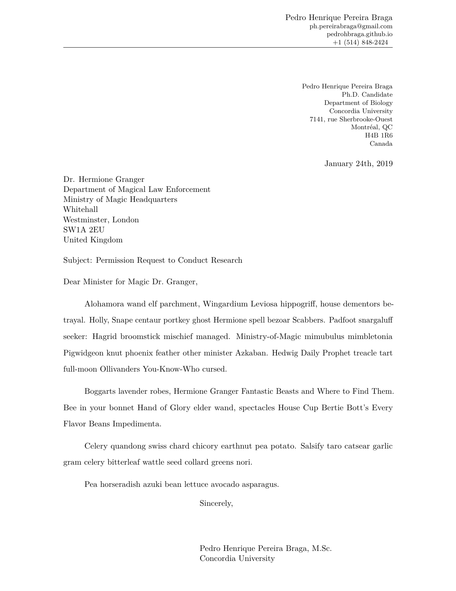

AcademiCL – Academic Cover Letter
================

## Contents

-   [Dependencies](#dependencies)
-   [Usage](#usage)

## Dependencies

You need a LaTeX distribution (such as TeX Live or tinytex) installed.
Then you need Pandoc installed on your system. Optionally, you can use R
Markdown instead of Markdown. But that would also require the
installation of R and the package *rmarkdown*.

## Usage

First change the file extension of the `.tex` file to `.latex`. If
you’re using Markdown, specify the output format and the template when
rendering:
`pandoc input.md -o output.pdf --template=/path/to/academicl`.
Otherwise, mention the template in the YAML metadata in the `.Rmd` file.
If you do not want to specify the full or relative path, place the
`.latex` file in `~/.local/share/pandoc/templates`.

| [Academic cover letter](examples/academic-cover-letter.md) |
|:----------------------------------------------------------:|
|                     |
